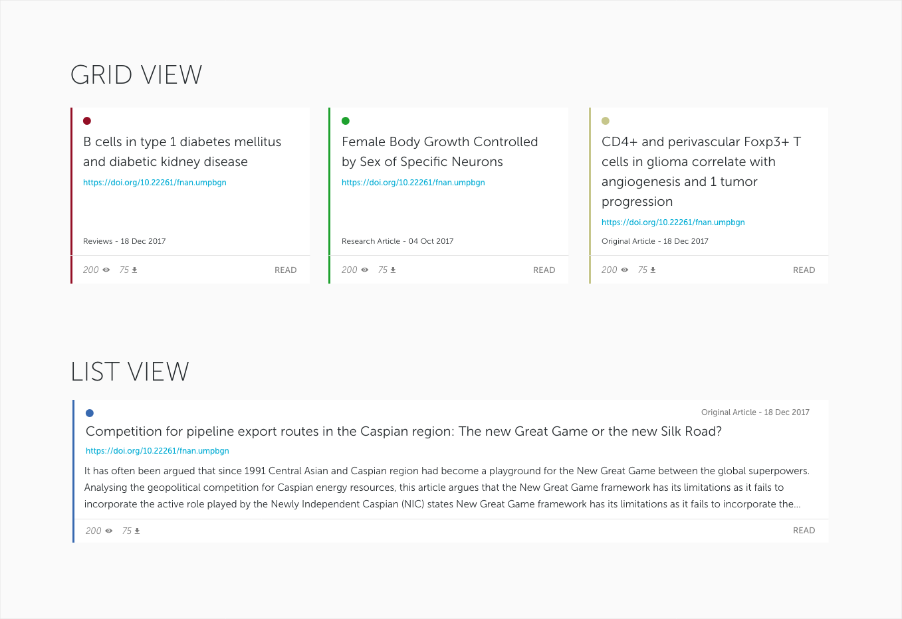

Veruscript Frontend Technical Test 2018
=======================================

Setup
----

1. Clone the repository
2. Run `yarn install`

The Assignment
--------

In `data/publications.json`, there is what would be a JSON feed of publications.

We want you to create an small web application page that will present this
feed as a list of publications to browse, with some visual aggregations.

Guidelines
--------

### DOs ###

 * Do ask for clarification on anything regarding this test - you may contact us at `developers@veruscript.com`.
 * Do use third-party libraries by installing them with Yarn.
 * Do use build tools and browser optimization tools.
 * Do make the web pages responsive.
 * Do use the latest standards.
 * Do use ECMA 6.
 * Do document what you have done and how to set it up.

### DONT's ###

 * Don't spend more than 2 hours on the assignment.
 * Don't use frameworks. However you may use either React or Backbone providing at least one of the
 views is NOT implemented with these.

### Nice to haves ###

 * Write tests if possible. A choice of Jest, Mocha, Chai, Sinon and Enzyme are already installed with Yarn.

The Specification
--------------

### Browse Articles View ###

  * In this test, we want to see functional examples. 

  * Articles can be shown as _Cards_, both in a _grid format_ and in a _list format_ (see image below),
    with the user able to toggle between these formats.

  * Both formats should show the following as a minimum:

     - Short title
     - DOI
     - Article Type (aka `publicationType`)
     - Publication date (Assume all datetimes are UTC unless specified)
     - Number of Views (`nView`)
     - Number of Downloads (`nDownloads`)
     - Journal colour (the colour used for the `journalId` does not have to match exactly -
       eg. You can use `LightCoral #F08080` to represent `RED`)

  * Only the _list format_ must show the `abstract`, and that text must be truncated to 3 lines.

  * Nice-to-have: In the _grid format_, when resizing the browser viewport,
    the cards could be animated to move to their new position on the page.

